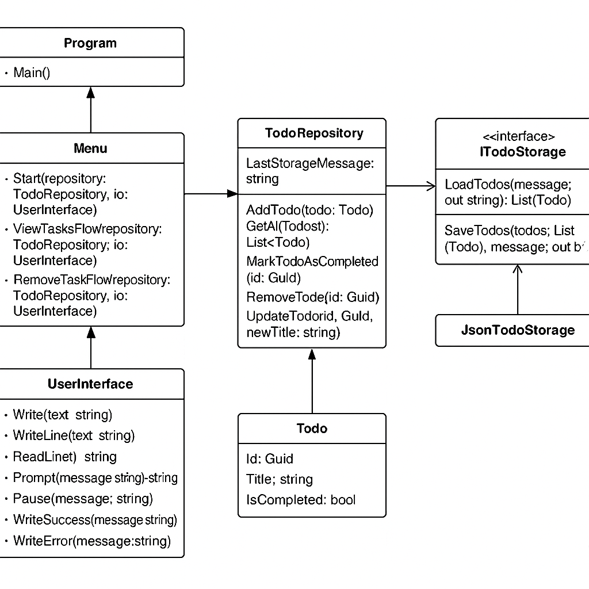

# 📝 TaskMasterConsoleApp

A simple and testable console-based Todo list manager built with .NET.

---

## 📌 Overview

TaskMasterConsoleApp is a C# console application that allows users to:

- ✅ Add, view, update, complete, and remove tasks
- ✅ Optionally assign due dates
- ✅ View tasks sorted by due date
- ✅ See clear, color-coded feedback in the console

The app uses clean architecture with separation of concerns, dependency injection, and full xUnit test coverage.

---

## 🧩 Project Structure

```
/TaskMasterConsoleApp
├── Models/          # The Todo model
├── Services/        # Business logic (TodoRepository)
├── Data/            # Storage abstraction and implementation (ITodoStorage + JsonTodoStorage)
├── UI/              # Console UI (Menu + UserInterface)
├── Tests/           # Unit tests using xUnit
├── docs/            # UML diagram and assets
├── todos.json       # Local task storage
└── Program.cs       # Application entry point
```

---

## 🔍 UML Diagram



---

## ⚙️ Features

- [x] Add task (with optional due date)
- [x] View tasks (sorted by due date)
- [x] Mark task as completed
- [x] Update task title
- [x] Remove task
- [x] Color-coded feedback (green for success, red for errors)
- [x] Console-based user interface
- [x] JSON-based storage with easy swap-out interface
- [x] Fully unit-tested (using xUnit)

---

## 💡 Design Principles

- **Separation of Concerns**: Logic, UI, and data layers are isolated.
- **Dependency Injection**: Storage and I/O are injected for flexibility and testability.
- **Repository Pattern**: Abstracts data access for easier refactoring.
- **Interface-Based Design**: Makes components modular and swappable.
- **Testability**: Core logic is tested using fake in-memory storage.

---

## 🧪 Testing

- Uses `xUnit` to test repository and UI logic
- Fake storage implementation ensures tests don’t touch the file system
- Tests verify task creation, completion, update, removal, and sorting

```bash
dotnet test --logger:"console;verbosity=detailed"
```

---

## 🚀 Run Locally

```bash
# Clean & build
dotnet clean && dotnet build

# Run the app
dotnet run --project TaskMasterApp
```

---

## 📂 Storage Format

Tasks are saved in a local `todos.json` file using `System.Text.Json`. The file path can be configured through `JsonTodoStorage`.

---

